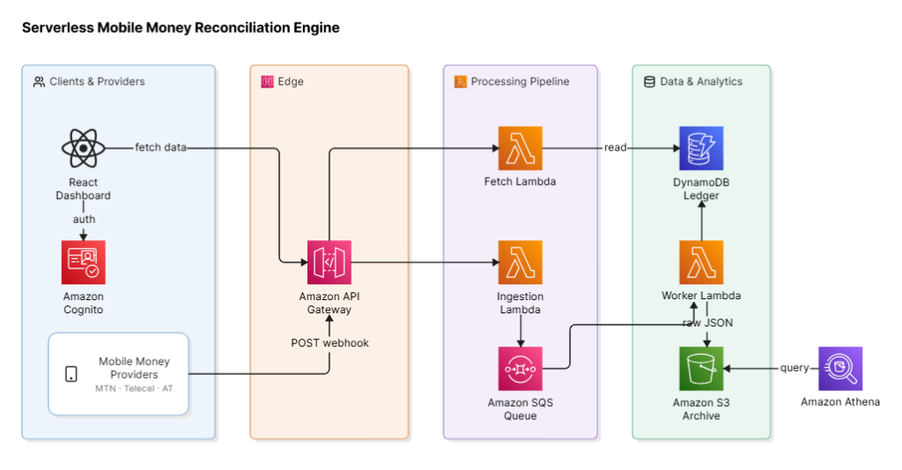

# OmniSync MoMo: Serverless Mobile Money Reconciliation Engine



## 📖 The Problem (For Non-Technical Folks)
Imagine running a business where customers pay you using three different mobile money networks (like MTN, Telecel, and AT). At the end of every day, you have to log into three different websites, download three different spreadsheets, and manually figure out if you actually received all your money. It's slow, prone to human error, and exhausting. 

## 💡 The Solution
**OmniSync MoMo** is a smart, automated system that solves this. Whenever a customer pays you on *any* network, the network instantly sends a notification (a "webhook") to OmniSync. Our system catches that notification, securely processes it, and updates a beautiful, unified dashboard in real-time. 

Instead of juggling spreadsheets, merchants can open one screen and instantly see all their transactions across every network in one place.

---

## 🏗️ Architecture (For Technical Folks)

OmniSync is a **100% Serverless, Event-Driven Application** built on AWS. It is designed to be highly scalable, fault-tolerant, and incredibly cheap to run (scaling down to zero when not in use).

### How it works:
1. **Authentication:** The React Frontend is secured by **Amazon Cognito**. Only authorized merchants can view their dashboard.
2. **Ingestion Layer:** Telco webhooks are caught by an **Amazon API Gateway** and passed to an **Ingestion Lambda**. This ensures lightning-fast response times back to the Telcos to prevent timeouts.
3. **Buffering Layer:** The payload is immediately pushed into an **Amazon SQS Queue**. This decouples ingestion from processing, meaning if the database ever goes down or spikes in traffic, no transactions are lost—they safely wait in the queue!
4. **Processing Layer:** A **Worker Lambda** automatically pulls messages from the queue. It securely archives the raw JSON payload to an **Amazon S3 Bucket** (for compliance and audits) and writes the processed transaction to an **Amazon DynamoDB** ledger using idempotent operations to prevent duplicate records.
5. **Presentation Layer:** The **React Frontend** calls the API Gateway, which triggers a **Fetch Lambda** to retrieve the latest transactions from DynamoDB and display them in a sleek, glassmorphic UI.

---

## 🛠️ Tech Stack
- **Frontend**: React, Vite, TailwindCSS, AWS Amplify, Recharts
- **Backend Infrastructure**: AWS Serverless Application Model (SAM) / CloudFormation
- **Compute**: AWS Lambda (Python 3.10)
- **Database & Storage**: Amazon DynamoDB, Amazon S3
- **Messaging**: Amazon SQS
- **Security & Auth**: Amazon Cognito

---

## 🚀 How to Run Locally

### 1. Deploy the Backend
Ensure you have the AWS CLI and SAM CLI installed and configured.
```bash
cd backend
sam build
sam deploy --guided
```
*Take note of your `HttpApiUrl`, `UserPoolId`, and `UserPoolClientId` in the terminal outputs.*

### 2. Run the Frontend
```bash
cd frontend
npm install
```
Create a `.env` file inside the `frontend` folder with the outputs from step 1:
```env
VITE_API_URL=https://<your-api-id>.execute-api.<region>.amazonaws.com/v1
VITE_USER_POOL_ID=<your-user-pool-id>
VITE_USER_POOL_CLIENT_ID=<your-client-id>
```
Start the local server:
```bash
npm run dev
```

### 3. Simulate a Transaction
Open a new terminal and fire this command to simulate a webhook arriving from a Telco:
```bash
curl -X POST https://<your-api-id>.execute-api.<region>.amazonaws.com/v1/webhooks/v1/momo \
     -H "Content-Type: application/json" \
     -H "x-signature: mock-signature" \
     -d '{
           "network": "MTN",
           "transaction_ref": "REF123456",
           "merchant_id": "M_888",
           "amount": 150.50
         }'
```
Watch your dashboard update in real-time!
